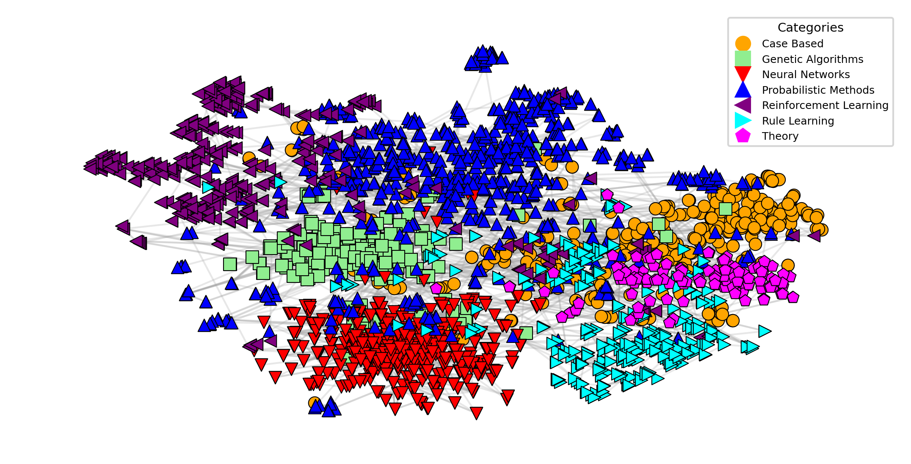
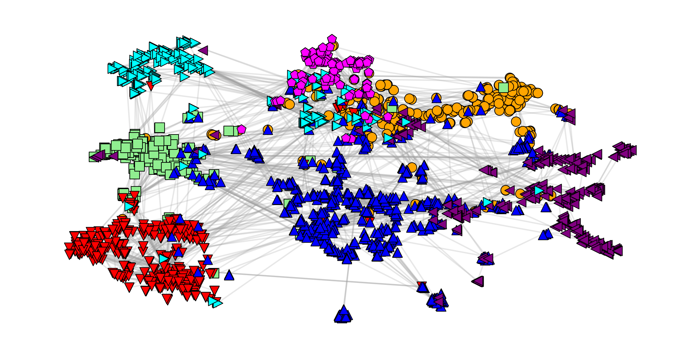

# Visualization and Evaluation of Multivariate Networks through Dimensionality Reduction and Graph Embeddings

  
  &nbsp;&nbsp;
  

<em>Figure 1: Cora: (a) Linear Combination by t-SNE and (b) Best GE (GCN - 64D) with t-SNE. Harmonic Trustworthiness: 0.782 vs. 0.775; Silhouette: 0.048 vs. 0.133.</em>

This repository contains the code and supplementary material for the paper **"Visualization and Evaluation of Multivariate Networks through Dimensionality Reduction and Graph Embeddings".**

Published at **GDxDR: Bridging Graph Drawing and Dimensionality Reduction**, workshop at **EuroVis 2026** (Nottingham, England, 8-12 June 2026).

## Paper Abstract

Analyzing Multivariate Networks (MVN) requires considering both graph structure and node attributes. However, most dimensionality reduction techniques operate on a single data modality, limiting their ability to comprehensively represent such networks. In this paper, we propose two workflows for MVN visualization that integrate structural and attribute information into a unified embedding process. The first workflow linearly combines structure- and attribute-based distances, while the second employs Graph Neural Network embeddings as an intermediate representation before projecting the data onto a 2D embedding. To evaluate neighborhood preservation across both data modalities, we introduce Harmonic Trustworthiness, a metric that balances structural and attribute-based preservation. Results on real-world datasets, including Cora and Amazon, indicate the potential to project a more representative 2D embedding with more suitable neighborhood preservation.

## Datasets

Cora contains scientific publications classified into 7 categories: Case Based, Genetic Algorithms, Neural Networks, Probabilistic Methods, Reinforcement Learning, Rule Learning, and Theory, connected by citation links. Each publication is represented by a bag-of-words over terms. Similarly, Amazon Computers is a segment of the Amazon co-purchase graph, where nodes represent goods, edges indicate that two goods are frequently purchased together, and node features are bag-of-words-encoded product reviews.  It contains 10 product categories: Computer Components, Data Storage, Desktops, Laptops, Monitors, Networking Products, Routers, Tablets, Video Projectors, and Webcams.

## Extended Tables

<em>Table 1: Cora: Comparison of workflows across method, dimensional, DR, and evaluation metrics. Results are averaged over 20 runs and reported as mean ± standard deviation; bold values denote the best result per metric.</em>

<table style="font-size:12px; border-collapse:collapse;">
<thead>
<tr>
<th>Worflow</th>
<th>Method</th>
<th>Dim</th>
<th>DR</th>
<th>Structure Trustworthiness</th>
<th>Attribute Trustworthiness</th>
<th>Harmonic Trustworthiness</th>
<th>Silhouette</th>
</tr>
</thead>
<tbody>
<tr><td>1</td><td>Lin. Comb.</td><td>∅</td><td>t-SNE</td><td>0.930±0.002</td><td>0.672±0.001</td><td><b>0.780±0.001</b></td><td>0.031±0.029</td></tr>
<tr><td>2</td><td>GCN</td><td>64</td><td>t-SNE</td><td>0.912±0.002</td><td>0.675±0.001</td><td>0.776±0.001</td><td>0.072±0.074</td></tr>
<tr><td>1</td><td>Lin. Comb.</td><td>∅</td><td>UMAP</td><td>0.937±0.001</td><td>0.658±0.002</td><td>0.773±0.002</td><td>-0.246±0.015</td></tr>
<tr><td>2</td><td>GCN</td><td>64</td><td>UMAP</td><td>0.894±0.003</td><td>0.673±0.002</td><td>0.771±0.002</td><td>-0.148±0.109</td></tr>
<tr><td>2</td><td>GAT</td><td>128</td><td>t-SNE</td><td>0.894±0.004</td><td>0.679±0.002</td><td>0.771±0.006</td><td><b>0.093±0.058</b></td></tr>
<tr><td>2</td><td>GAT</td><td>128</td><td>UMAP</td><td>0.883±0.005</td><td>0.676±0.003</td><td>0.765±0.006</td><td>-0.157±0.100</td></tr>
<tr><td>2</td><td>GraphCL</td><td>64</td><td>t-SNE</td><td>0.878±0.010</td><td>0.670±0.007</td><td>0.760±0.008</td><td>0.074±0.064</td></tr>
<tr><td>2</td><td>GraphCL</td><td>64</td><td>UMAP</td><td>0.864±0.012</td><td>0.670±0.007</td><td>0.754±0.009</td><td>-0.148±0.123</td></tr>
<tr><td>2</td><td>GAT</td><td>2</td><td>∅</td><td>0.767±0.049</td><td>0.604±0.020</td><td>0.681±0.031</td><td>0.053±0.150</td></tr>
<tr><td>2</td><td>GCN</td><td>2</td><td>∅</td><td>0.664±0.040</td><td>0.562±0.015</td><td>0.608±0.025</td><td>-0.420±0.141</td></tr>
<tr><td>2</td><td>GraphCL</td><td>2</td><td>∅</td><td>0.560±0.030</td><td>0.560±0.010</td><td>0.560±0.019</td><td>-0.291±0.069</td></tr>
</tbody>
</table>

 

<em>Table 2: Amazon: Comparison of workflows across method, dimensional, DR, and evaluation metrics. Results are averaged over 20 runs and reported as mean ± standard deviation; bold values denote the best result per metric.</em>

<table style="font-size:12px; border-collapse:collapse;">
<thead>
<tr>
<th>Wf</th>
<th>Method</th>
<th>Dim</th>
<th>DR</th>
<th>Structure Trustworthiness</th>
<th>Attribute Trustworthiness</th>
<th>Harmonic Trustworthiness</th>
<th>Silhouette</th>
</tr>
</thead>
<tbody>
<tr><td>1</td><td>Lin. Comb.</td><td>∅</td><td>t-SNE</td><td>0.912±0.001</td><td>0.766±0.0004</td><td><b>0.833±0.0004</b></td><td><b>-0.123±0.050</b></td></tr>
<tr><td>1</td><td>Lin. Comb.</td><td>∅</td><td>UMAP</td><td>0.872±0.001</td><td>0.753±0.001</td><td>0.808±0.0004</td><td>-0.298±0.027</td></tr>
<tr><td>2</td><td>GCN</td><td>256</td><td>t-SNE</td><td>0.921±0.001</td><td>0.591±0.001</td><td>0.720±0.001</td><td>-0.220±0.096</td></tr>
<tr><td>2</td><td>GCN</td><td>256</td><td>UMAP</td><td>0.912±0.001</td><td>0.583±0.002</td><td>0.711±0.001</td><td><b>-0.040±0.064</b></td></tr>
<tr><td>2</td><td>GraphCL</td><td>64</td><td>t-SNE</td><td>0.896±0.022</td><td>0.587±0.010</td><td>0.709±0.013</td><td>-0.255±0.110</td></tr>
<tr><td>2</td><td>GraphCL</td><td>64</td><td>UMAP</td><td>0.885±0.022</td><td>0.580±0.009</td><td>0.701±0.012</td><td>-0.185±0.128</td></tr>
<tr><td>2</td><td>GAT</td><td>16</td><td>t-SNE</td><td>0.776±0.027</td><td>0.592±0.021</td><td>0.671±0.016</td><td>-0.309±0.076</td></tr>
<tr><td>2</td><td>GAT</td><td>16</td><td>UMAP</td><td>0.738±0.031</td><td>0.584±0.019</td><td>0.650±0.015</td><td>-0.443±0.089</td></tr>
<tr><td>2</td><td>GCN</td><td>2</td><td>∅</td><td>0.607±0.057</td><td>0.609±0.002</td><td>0.618±0.023</td><td>-0.338±0.136</td></tr>
<tr><td>2</td><td>GAT</td><td>2</td><td>∅</td><td>0.692±0.046</td><td>0.554±0.017</td><td>0.598±0.021</td><td>-0.426±0.152</td></tr>
<tr><td>2</td><td>GraphCL</td><td>2</td><td>∅</td><td>0.571±0.036</td><td>0.610±0.002</td><td>0.592±0.022</td><td>-0.433±0.109</td></tr>
</tbody>
</table>

## Repository Contents

- [GDxDR_Cora.ipynb](./GDxDR_Cora.ipynb): Code and supplementary experiments for the Cora dataset.
- [GDxDR_Amazon.ipynb](./GDxDR_Amazon.ipynb): Code and supplementary experiments for the Amazon dataset.

## Environment Setup

Please use Python **3.10.3** and install dependencies using `pip install -r requirements.txt`.

## How to Run

In a Jupyter Notebook, open and run:

- [GDxDR_Cora.ipynb](./GDxDR_Cora.ipynb)
- [GDxDR_Amazon.ipynb](./GDxDR_Amazon.ipynb)

## Acknowledgments

Pedro A. M. Gagini gratefully acknowledges the funding and infrastructure provided by the TEP – Tutorial Education Program (Computer Science and Media Technology Department, Linnaeus University) and by the Institute of Mathematics and Computer Sciences (ICMC), University of São Paulo (Grant No. 2095/2025).

## Citation

If you use this material, please cite:

> Gagini, P. A. M., Martins, R. M., Soares, A., Paulovich, F., & Linhares, C. D. G. (2026). MVN-Benchmark (Version 1.0.0) [Computer software]. https://github.com/PedroAugustoMartinsG/MVN-Benchmark

> @software{Gagini_MVN-Benchmark_2026,
author = {Gagini, Pedro A. M. and Martins, Rafael M. and Soares, Amilcar and Paulovich, Fernando and Linhares, Claudio D. G.},
month = apr,
title = {{MVN-Benchmark}},
url = {https://github.com/PedroAugustoMartinsG/MVN-Benchmark},
version = {1.0.0},
year = {2026}
}
